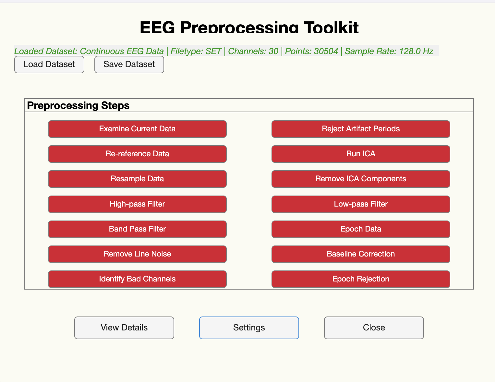

DATA PREPROCESSING TOOLKIT FOR EEGLAB This MATLAB-based toolkit provides a streamlined preprocessing pipeline for EEG data within the EEGLAB environment. It integrates widely used EEGLAB plugins and automates common preprocessing steps such as filtering, artifact removal, and IC classification.

Game: <a href="https://github.com/EEGToolkit/DataPreprocessing_Analysis"><i class="large github icon "></i>EEGLab Toolkit</a>
