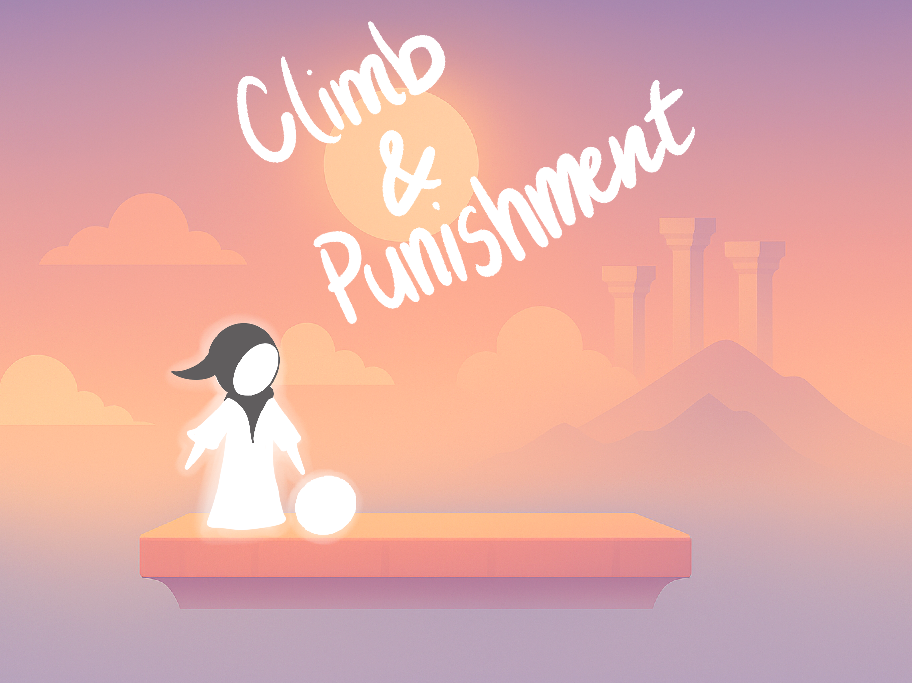

Climb and punishment is a Fodian game inspired by games like Getting Over It, Jump King, and Pogostuck. The twist of this game, is you are askedc to save souls you meet along the way; however, 
they make your climb drastically harder. Will you save them all or be selfish and reach the top by yourself?

Game: <a href="https://alyoola.itch.io/climb-and-punishment"><i class="large github icon "></i>Climb and Punishment</a>
